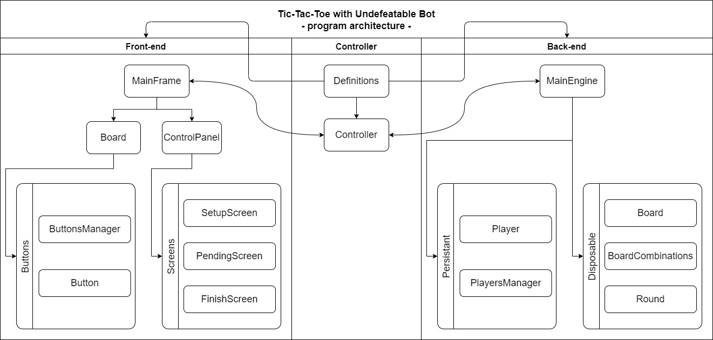
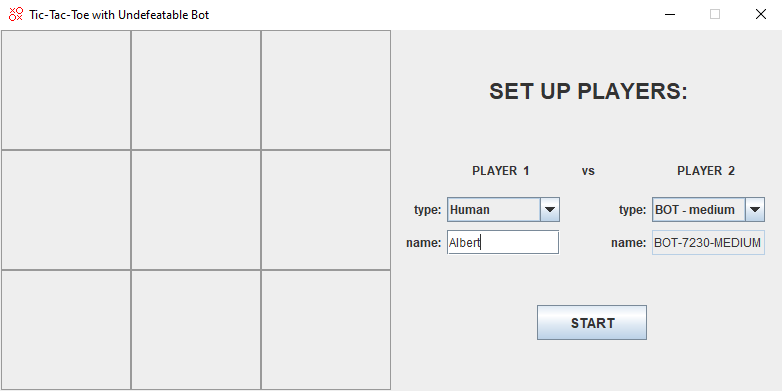
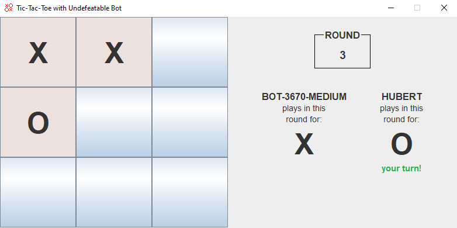
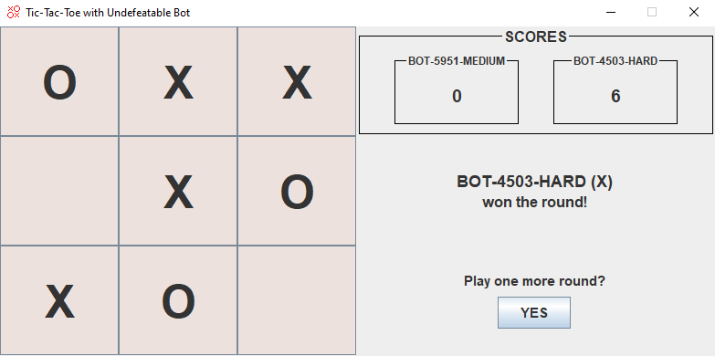

# Tic-Tac-Toe with Undefeatable Bot

## Table of Contents
1. [Basic Info](#Basic-Info)
2. [Features](#Features)
3. [Bot Logic](#Bot-Logic)
4. [Architecture](#Architecture)
5. [Screenshots](#Screenshots)
6. [License](#License)

## Basic Info

This program is a desktop Tic-Tac-Toe game with multiplayer and multi-round modes. One or each of the players can be a bot which has three difficulty levels: easy, medium and hard. The latter one is undefeatable.

| Parameter                               | Data                                             |
| :-------------------------------------: | :----------------------------------------------: |
| Program name:                           | Tic-Tac-Toe with Undefeatable Bot                |
| Date of creation:                       | January 2022                                     |
| Technologies used:                      | Java SE, Maven                                   |
| Time spent to   create the program: | ~4 days                                          |
| Author:                                 | Herman Ciechanowiec   herman@ciechanowiec.eu |
| License:                                | MIT No Attribution License                       |

## Functionality

The program has the following features:
- graphical user interface
- multiplayer mode (human vs human, human vs bot, bot vs bot)
- multi-round mode
- bot with three difficulty levels: easy, medium and hard (undefeatable)
- random marks assignment for each round (X/O)

## Bot Logic
* BOT-EASY makes technically valid random moves.
* BOT-MEDIUM makes moves according to the following logic:
    - if BOT-MEDIUM has already two marks in a line and can win with one further move, it does so,
    - if a BOT-MEDIUM's opponent can win with one move, BOT-MEDIUM makes the move necessary to block this,
    - otherwise, BOT-MEDIUM makes a random move as BOT-EASY.
* BOT-HARD makes moves using a minimax algorithm and according to the following logic:
    - BOT-HARD never loses,
    - BOT-HARD always wins if it's opponent's moves make it possible,
    - there are two possible outcomes when playing against BOT-HARD: a draw or BOT-HARD's win,
    - if two BOTS-HARD play against each other the round always finishes with a draw.
    
## Architecture

The program is divided into three parts: front-end (graphical user interface), back-end (logic of the program) and the controller, which handles a relationship between the front-end and the back-end:   

## Screenshots
<kbd></kbd>  
<kbd></kbd>  
<kbd></kbd> 

## License
The program is subject to MIT No Attribution License

Copyright © 2022 Herman Ciechanowiec

Permission is hereby granted, free of charge, to any person obtaining a copy of this
software and associated documentation files (the "Software"), to deal in the Software
without restriction, including without limitation the rights to use, copy, modify,
merge, publish, distribute, sublicense, and/or sell copies of the Software, and to
permit persons to whom the Software is furnished to do so.

The Software is provided "as is", without warranty of any kind, express or implied,
including but not limited to the warranties of merchantability, fitness for a
particular purpose and noninfringement. In no event shall the authors or copyright
holders be liable for any claim, damages or other liability, whether in an action
of contract, tort or otherwise, arising from, out of or in connection with the
Software or the use or other dealings in the Software.
